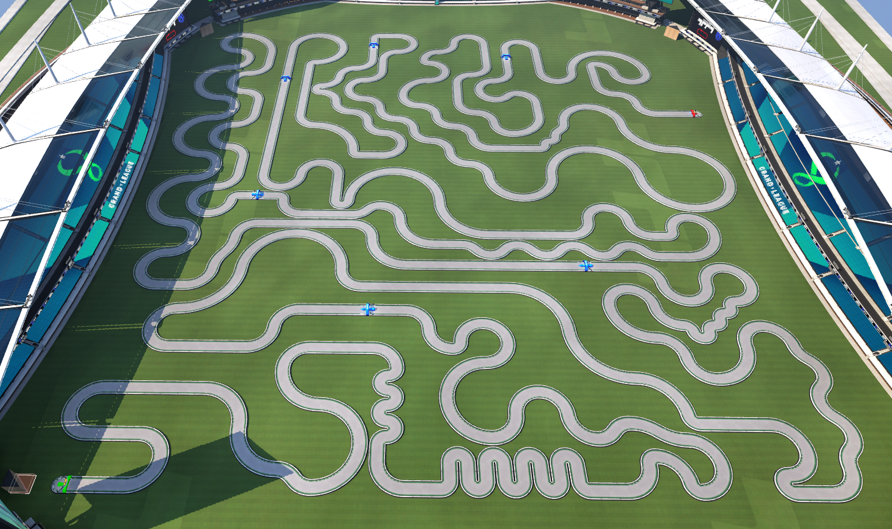
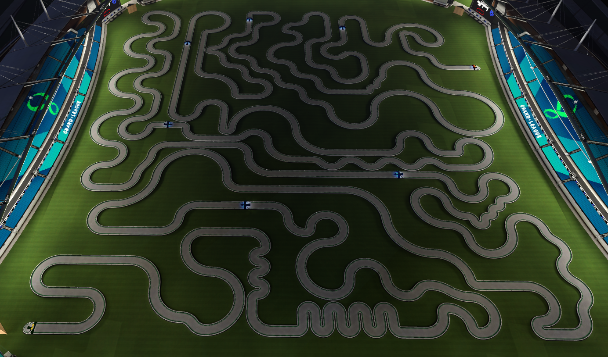
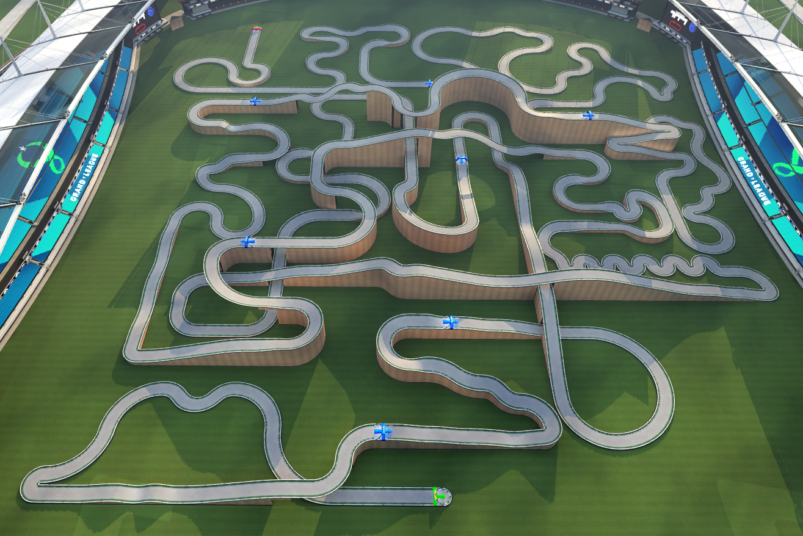
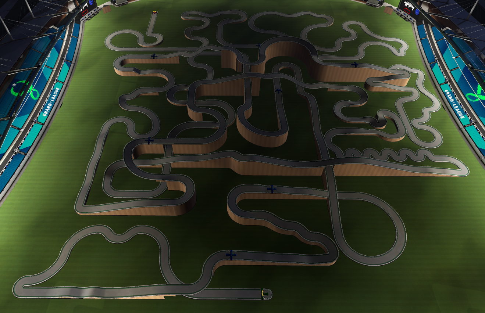
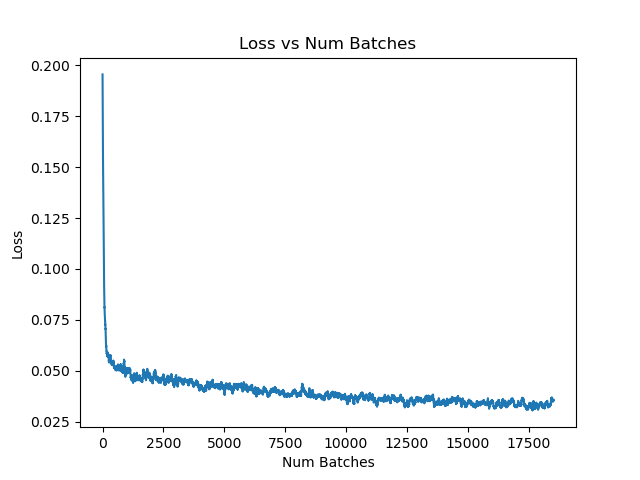
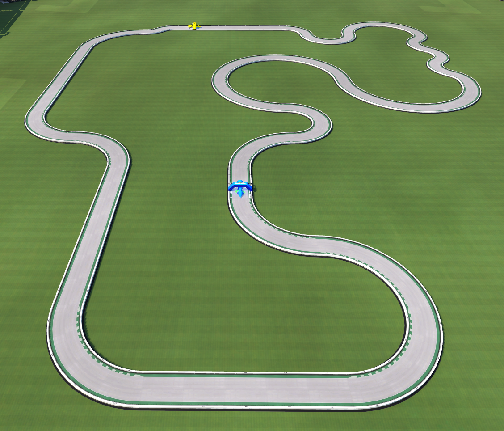
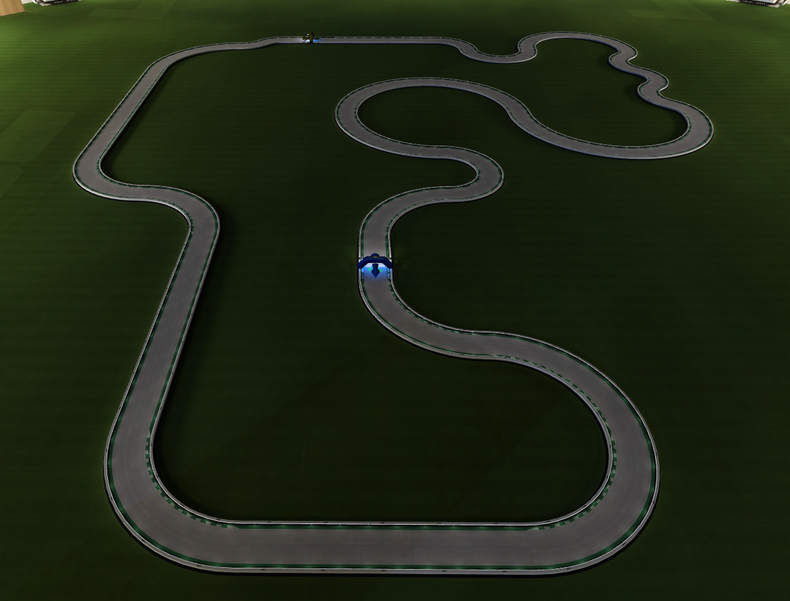
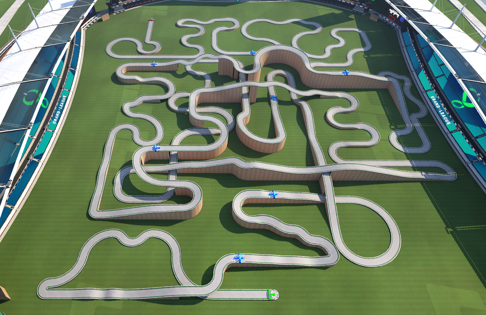

# [Website](https://jvenberg.github.io/TrackmaniaSelfDriving/)

# Summary Video
<iframe width="560" height="315" src="https://www.youtube-nocookie.com/embed/uNpkn2Vv5N4" title="YouTube video player" frameborder="0" allow="accelerometer; autoplay; clipboard-write; encrypted-media; gyroscope; picture-in-picture" allowfullscreen></iframe>

# Table of Contents
1. [Introduction](#introduction)
2. [Data Collection](#data-collection)
3. [Model](#model)
4. [Challenges](#challenges)
5. [Training & Tuning](#training--tuning)
6. [Results](#results)
7. [Potential Improvements](#potential-improvements)
8. [Code Citations](#code-citations)

# Introduction

Trackmania 2020 is a free racing game that allows you to create custom racetracks
and race on them. For my final project, I decided to explore Convolutional Neural Networks
by training one to drive the Trackmania car. The CNN takes in images from the game
and outputs steering and speed information to control the car. By training the
model on example gameplay consisting of screenshots and car telemetry, the model is
able to replicate the driving behavior to autonomously control the car.

[[Back To Top](#table-of-contents)]

# Data Collection

In order to get reliable telemetry from the car for training, I utilized a scripting platform
built for Trackmania 2020 called [OpenPlanet](https://openplanet.nl/). OpenPlanet
allowed me to run scripts inside of TrackMania and access information from the
game. This not only gave me access to the speed of the car, but it also allowed
me to track when the game was actually in progress which automated the starting/stopping
of the recording process.

I created multiple large tracks of varying difficulty, some with a significant amount of
elevation changes, and some that were completely flat. Of these tracks, I subjected them
to multiple different lighting conditions to try to get the model to generalize regardless
of lighting. Here are a few examples of the tracks that I recorded on:

In order to get the data from the [OpenPlanet script](Plugin_TrackManiaCustomAPI.as) to the Python [recorder.py](recorder.py)
script, I used network sockets to communicate the telemetry data from the car to the recorder.
I also used d3dshot to get fast screenshots of the game view. I choose a fixed angle car view that
did not include any of the car in it to minimize any effect that the car's pose and camera angle might have
on the training.

Additionally, I implemented controller monitoring to get the steering angle input by me.
I also implemented various keybinds to start/stop/pause the recording to aid in the recording process.
I also implemented a datapoint cache that would cache around 10 seconds of results before saving them
to disk. This allowed me to implement keybinds to revert data when I would crash in
to walls, take bad corners, pause the game, etc. to avoid recording bad data or the pause screen.

In total I recorded ~70,000 data points over ~2 hours of driving to construct my dataset.
I then [preprocessed that data](process_data.py)
by flipping the image and steering angles to ensure that there would not be any bias in one direction
which doubled the data points to ~140,000. I then split that data 85%-15% into a training and test dataset.
I also resized each image to be 64x64 to reduce the size of the model and improve runtime performance,
since I knew that I would be aiming for real-time performance. I also converted each image to greyscale
to reduce the size of the dataset, since the color of the image has no correlation to the direction of the track.

Here is an example of what the data looks like after processing:

[[Back To Top](#table-of-contents)]

# Model

[The model](model.py) I used was based on an Nvidia paper titled [End to End Learning for Self-Driving Cars](https://arxiv.org/pdf/1604.07316.pdf).
In that paper, they train a self-driving car on real world data. I thought that the model architecture would
be a good starting point for my model. The model is a regression model consisting
of 5 convolutional layers and 5 densely connected layers with one steering output.
Here is the neural net that Nvidia described in their paper:

I expanded the output to be two values instead of one for both steering and speed. I used a
Relu activation function for each densely connected layer. After experimentation, I added
batch normalization layers between each convolutional layer to improve performance
on my dataset. Additionally, I added dropout regularization between each
densely connected layer in order to improve generalization of the model. I also found that
a final atan operation after the last densely connected layer slightly improved performance compared to
no operation or softsign. Finally, I scaled it to work with my 64x64 image input. Here is the neural net
that I used (the dropout layers aren't shown since the visualization library doesn't support the
training configuration of the network):

[[Back To Top](#table-of-contents)]

# Challenges

There are a number of challenges/obstacles that I ran into with the data collection and training of
my model.

The first was that the speed data was between [0-~300]. That decreased the performance
of the prediction. I was able to fix this by normalized the data to be between [0-1].

The second overall issue with trying to replicate my behavior is that the act of driving in a video game
naturally produces noisy and unpredictable data. For instance, there are
many data points where my inputs were not the ideal inputs and they likely differ significantly
from other similar situations. I worked off the assumption that the errors in the data would even
out, but this issue probably explains why the accuracy of the model is fairly low, and the low quality
data likely held back the performance of the model.

Lastly, even after driving over an hour, I found that there were many holes in my dataset. For example,
by only recording ideal driving, the network rarely saw how to recover from unideal situations like facing
a wall, being largely off center, or right against walls. This resulted in poor performance when the network
got in these situations. In order to remedy this, I went back and recorded a lot of data where I would pause
the recording, put the car in an unideal situation, then resume recording the correction.

[[Back To Top](#table-of-contents)]

# Training & Tuning

For this project, I also wanted to explore automated hyperparameter tuning. Using PyTorch resources online,
I found that RayTune allowed me to automate the parameter sweep process while also parallelizing the
training using fractional GPUs and also early termination of poorly performing trials. I implemented
[a tuning script](tune.py) that sweeps over a configuration space. I optimized over 4 parameters: learning rate, batch size, decay, drop out percent. I also integrated the reporting with [wandb.ai](wandb.ai) to visualize the trials and results in an interactive way. Here is an example of one of my parameter sweeps:

### [Interactive WandB Report](https://wandb.ai/jackvenberg/raytune-trackmania-hyperparameter-tuning/reports/TrackmaniaNet-HyperParameter-Tuning--Vmlldzo3NjMyMzg)

After finding optimized hyperparameters, [I trained the model](train.py) over 15 epochs.

[[Back To Top](#table-of-contents)]

# Results

Since the model is a regression model, I measured the accuracy of the model to be the percent of results that
were within 0.10 of the expected value. Testing the tuned model on the test dataset yielded these results:

| Dataset | Loss | Overall Correctness | Speed Correctness | Steering Correctness |
| --- | --- | --- | --- | --- |
| Training | 0.000466 | 26.558203% | 65.301796% | 39.880848% |
| Test | 0.000565 | 24.595909% | 64.447144% | 37.061935% |

As explained earlier, the accuracy probably isn't great due to
the large amount of noisy, bad data. However, the accuracy is only one part of the picture. The real question is how does it perform when used to control the car...

The results of [using the model to control the car](inference.py) were impressive, but not perfect. Even after adding more data to recover from bad situations, it would often get stuck on maps with hard turns. However, it performed surprisingly well on maps with more gradual turns, and it was able to generalize well to different times of day. It was also very fast, only taking 2-5 ms to go from
image to prediction, which allowed the car to respond quickly to different situations.

Here is an example of it running well on a greatly simplified map that was _not_ included in the training or test data (3rd person perspective was a replay for reference; it only inferenced on the 1st person perspective):

## Simple Maps

### Trackmania 2020 Self-Driving - Day - 1st Person
<iframe width="560" height="315" src="https://www.youtube-nocookie.com/embed/J7W1Fy5_ayA" title="YouTube video player" frameborder="0" allow="accelerometer; autoplay; clipboard-write; encrypted-media; gyroscope; picture-in-picture" allowfullscreen></iframe>

### Trackmania 2020 Self-Driving - Day - 3rd Person
<iframe width="560" height="315" src="https://www.youtube-nocookie.com/embed/_x_mLMAUybc" title="YouTube video player" frameborder="0" allow="accelerometer; autoplay; clipboard-write; encrypted-media; gyroscope; picture-in-picture" allowfullscreen></iframe>

### Trackmania 2020 Self-Driving - Night - 1st Person
<iframe width="560" height="315" src="https://www.youtube-nocookie.com/embed/E27esEBTplI" title="YouTube video player" frameborder="0" allow="accelerometer; autoplay; clipboard-write; encrypted-media; gyroscope; picture-in-picture" allowfullscreen></iframe>

### Trackmania 2020 Self-Driving - Night - 3rd Person
<iframe width="560" height="315" src="https://www.youtube-nocookie.com/embed/q7tpanRJJZ4" title="YouTube video player" frameborder="0" allow="accelerometer; autoplay; clipboard-write; encrypted-media; gyroscope; picture-in-picture" allowfullscreen></iframe>

## Intermediate Map

I also ran the car on a modified version of one of the training tracks with less sharp corners and different lighting. Also, due to a bug in an update of the game, I was only able to make the car transparent instead of hidden. It was able to generalize even with the car in frame:

### Trackmania 2020 Self-Driving - Intermediate - Day - 1st Person
<iframe width="560" height="315" src="https://www.youtube-nocookie.com/embed/0y7iXZR67Qo" title="YouTube video player" frameborder="0" allow="accelerometer; autoplay; clipboard-write; encrypted-media; gyroscope; picture-in-picture" allowfullscreen></iframe>

Overall, I was happy with the performance, and it leaves room for improvement.

[[Back To Top](#table-of-contents)]

# Potential Improvements

Probably the largest potential improvement would be collecting more high-quality training data.
I suspect that a large reason for the occasionally unpredictable, noisy, and non-fault-tolerant
performance of the model is the lack of large amounts of data to learn from. If I had more time,
I would have implemented a dual recording/inferencing script that quickly allowed me to switch
between the model and my own inputs. This would allow me to record specific scenarios where the
model is failing at and allow me to get more relevant data for learning.

Additionally, if I had more time, I would experiment with changing the model more. I only added
small adjustments to the Nvidia model, but I could have potentially improved it more to fit the
task.

[[Back To Top](#table-of-contents)]

# Code Citations

| File | Work Description |
| --  | --- |
| `dataset.py` | Implemented by me. Heavily based on examples from [PyTorch](https://pytorch.org/tutorials/beginner/basics/data_tutorial.html). |
| `inference.py` | Implemented entirely by me besides one line of steering smoothing from [this project](https://github.com/SullyChen/Autopilot-TensorFlow/). |
| `make_link.bat` | Implemented entirely by me to hard link OpenPlanet plugin file to plugin dir. |
| `model.py` | Implemented by me. Inspired by [Nvidia](https://arxiv.org/pdf/1604.07316.pdf). Adapted from [examples from class](https://github.com/pjreddie/uwimg/blob/main/tutorial2_cnns_in_pytorch.ipynb). |
| `Plugin_TrackManiaCustomAPI.as` | Implemented entirely by me. |
| `process_data.py` | Implemented entirely by me.
| `recorder.py` | Implemented entirely by me besides XboxController class adapted slightly from [here](https://stackoverflow.com/questions/46506850/how-can-i-get-input-from-an-xbox-one-controller-in-python). |
| `train.py` | Implemented by me. Adapted from [examples from class](https://github.com/pjreddie/uwimg/blob/main/tutorial2_cnns_in_pytorch.ipynb). |
| `tune.py` | Implemented entirely by me. Adapted from [PyTorch](https://pytorch.org/tutorials/beginner/hyperparameter_tuning_tutorial.html). |
| `visualize_model.py` | Implemented entirely by me. |

[[Back To Top](#table-of-contents)]
