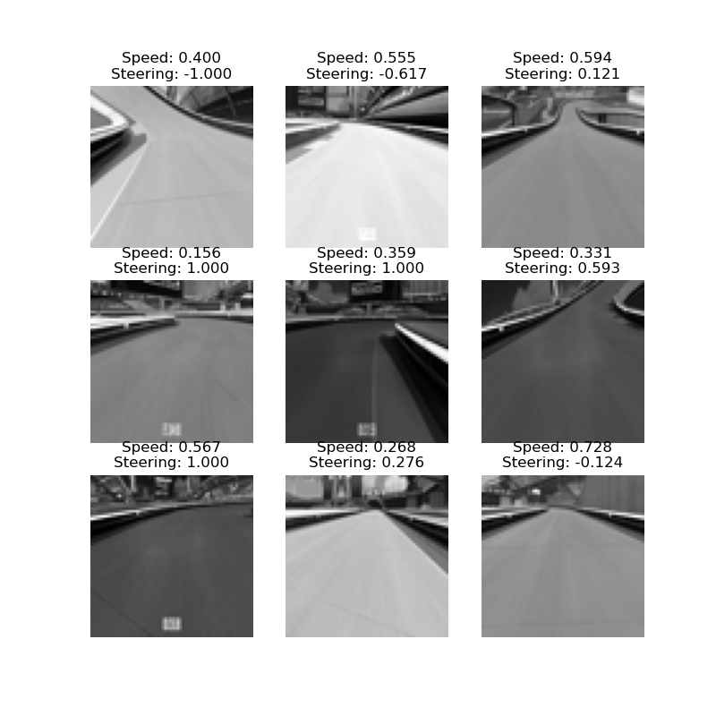
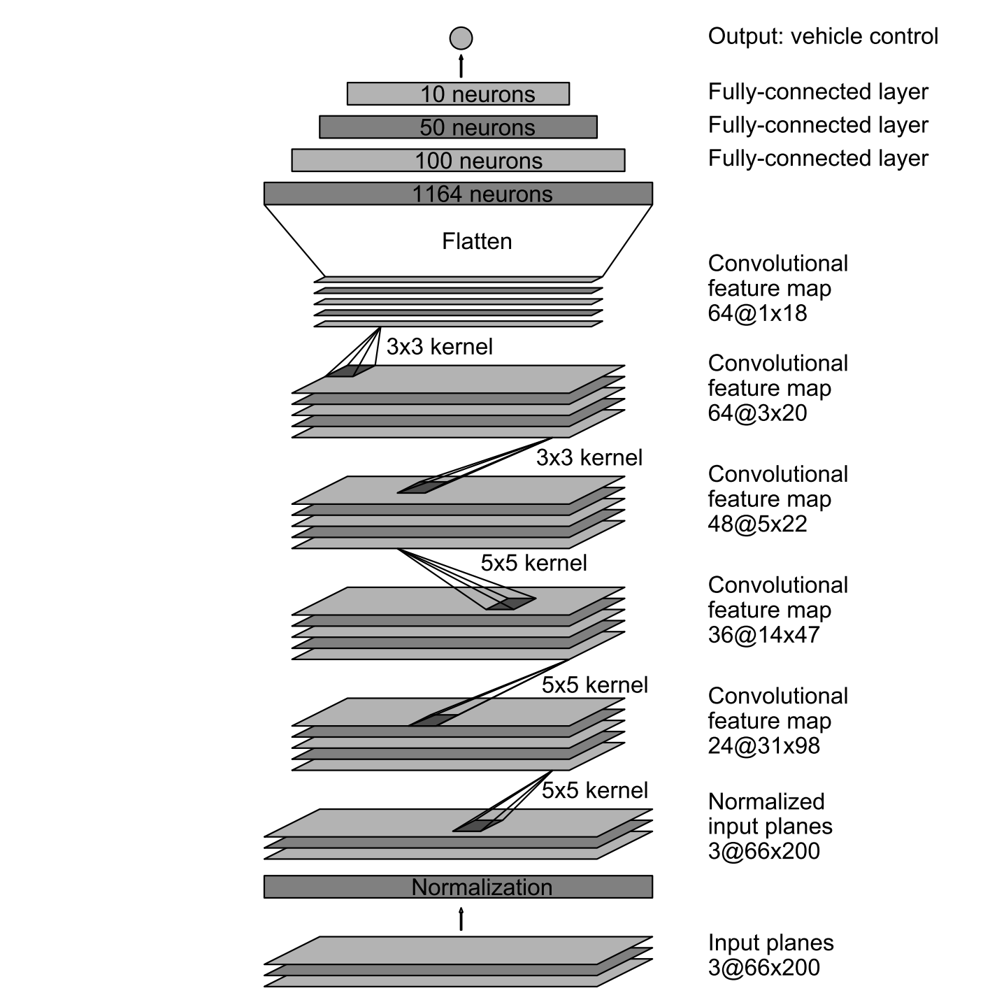
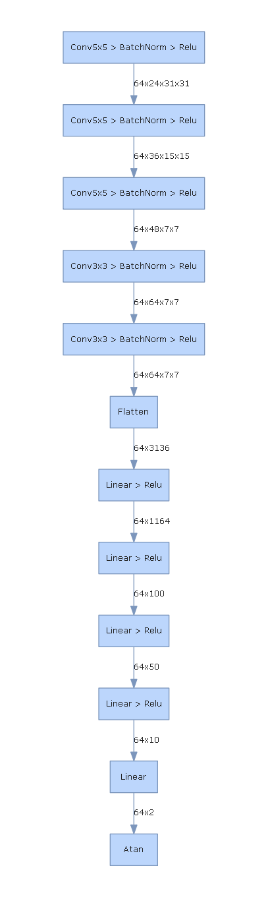

# Writeup

## Summary Video

## Introduction

Trackmania 2020 is a free racing game that allows you to create custom racetracks
and race on them. For my final project, I decided to explore Convolutional Neural Networks
by training one to drive the Trackmania car. The CNN takes in images from the game
and outputs steering and speed information to control the car. By training the
model on example gameplay consisting of screenshots and car telemetry, the model is
able to replicate the driving behavior to autonomously control the car.

## Data Collection

In order to get reliable telemetry from the car for training, I utilized a scripting platform
built for Trackmania 2020 called [OpenPlanet](https://openplanet.nl/). OpenPlanet
allowed me to run scripts inside of TrackMania and access information from the
game. This not only gave me access to the speed of the car, but it also allowed
me to track when the game was actually in progress which automated the starting/stopping
of the recording process.

In order to get the data from the [OpenPlanet script](https://github.com/JVenberg/TrackmaniaSelfDriving/blob/main/Plugin_TrackManiaCustomAPI.as) to the Python [recorder.py](https://github.com/JVenberg/TrackmaniaSelfDriving/blob/main/recorder.py)
script, I used network sockets to communicate the telemetry data from the car to the recorder.
I also used d3dshot to get fast screenshots of the game view. I choose a fixed angle car view that
did not include any of the car in it to minimize any affect that the car's pose and camera angle might have
on the training.

In total I recorded ~70,000 data points over ~2 hours of driving to construct my dataset.
I then [preprocessed that data](https://github.com/JVenberg/TrackmaniaSelfDriving/blob/main/process_data.py)
by flipping the image and steering angles to ensure that there would not be any bias in one direction
which doubled the data points to ~140,000. I then split that data 85%-15% into a training and test dataset.
I also resized each image to be 64x64 to reduce the size of the model and improve runtime performance,
since I knew that I would be aiming for realtime performance. I also converted each image to greyscale
to reduce the size of the dataset, since the color of the image has no correlation to the direction of the track.

Here is an example of what the data looks like after processing:

## Model

The model I used was based on an NVidia paper titled [End to End Learning for Self-Driving Cars](https://arxiv.org/pdf/1604.07316.pdf).
In that paper, they train a self-driving car on real world data. I thought that the model architecture would
be a good starting point for my model. Here is the neural net that NVidia used:

After experimentation, I added batch normalization layers between each convolutional layer to
improve performance on my dataset. I also scaled it to work with my 64x64 image input. Here is the
neural net that I used:

## Challenges

## Tuning

## Results

### Trackmania 2020 Self-Driving - Day - 1st Person
<iframe width="560" height="315" src="https://www.youtube-nocookie.com/embed/J7W1Fy5_ayA" title="YouTube video player" frameborder="0" allow="accelerometer; autoplay; clipboard-write; encrypted-media; gyroscope; picture-in-picture" allowfullscreen></iframe>

### Trackmania 2020 Self-Driving - Day - 3rd Person
<iframe width="560" height="315" src="https://www.youtube-nocookie.com/embed/_x_mLMAUybc" title="YouTube video player" frameborder="0" allow="accelerometer; autoplay; clipboard-write; encrypted-media; gyroscope; picture-in-picture" allowfullscreen></iframe>

### Trackmania 2020 Self-Driving - Night - 1st Person
<iframe width="560" height="315" src="https://www.youtube-nocookie.com/embed/E27esEBTplI" title="YouTube video player" frameborder="0" allow="accelerometer; autoplay; clipboard-write; encrypted-media; gyroscope; picture-in-picture" allowfullscreen></iframe>

### Trackmania 2020 Self-Driving - Night - 3rd Person
<iframe width="560" height="315" src="https://www.youtube-nocookie.com/embed/q7tpanRJJZ4" title="YouTube video player" frameborder="0" allow="accelerometer; autoplay; clipboard-write; encrypted-media; gyroscope; picture-in-picture" allowfullscreen></iframe>

## Potential Improvements
